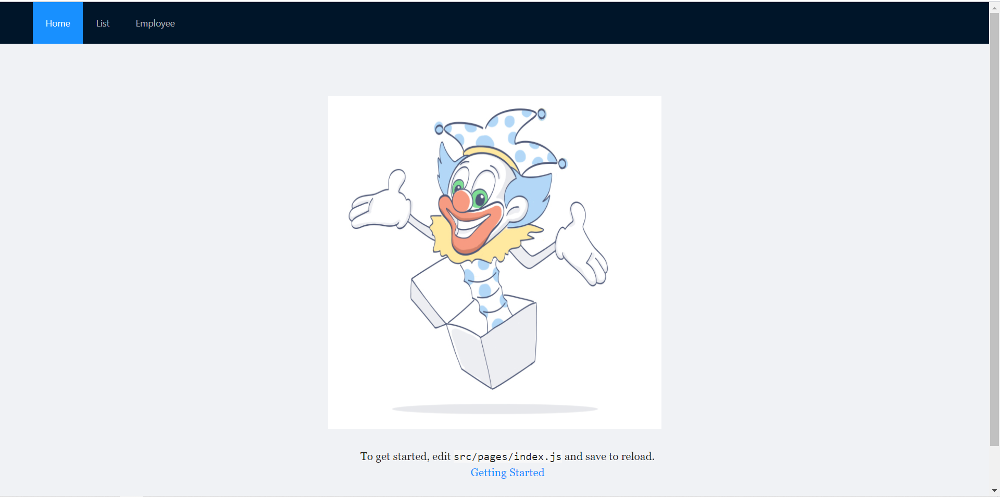
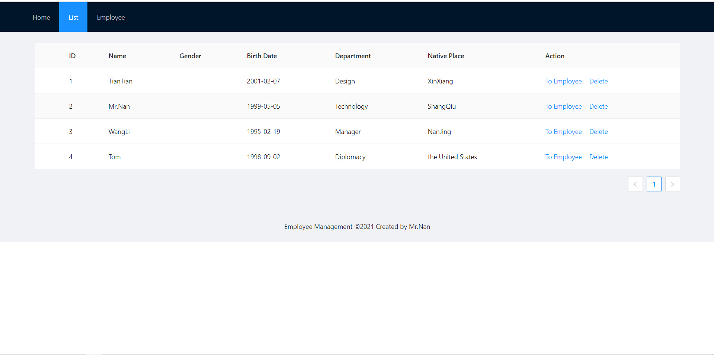
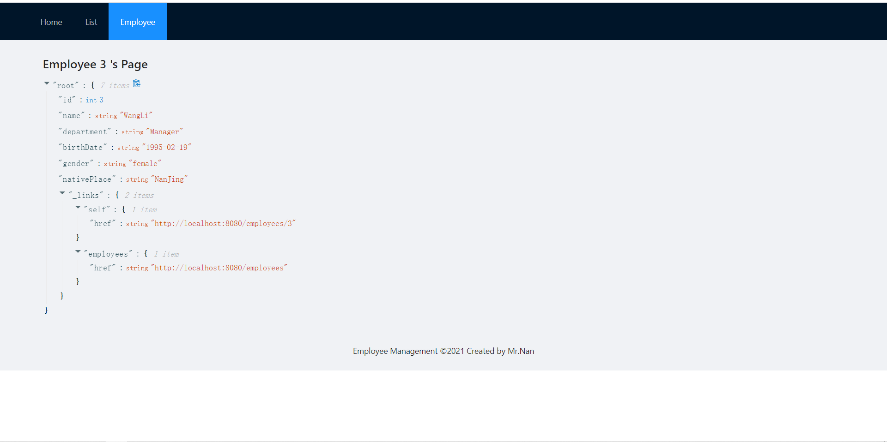

# README

仓库地址：https://gitee.com/Mr-Nan05/employee-management.git

### 效果截图





### front-end

前端功能完成50%，此前需要先启动后端

```shell
cd employee-frontend
yarn(或者npm install,报错则安装相应工具)
yarn start(或者npm start)

浏览器打开http://localhost:8000
```

### back-end

后端功能已基本完善

运行前请先启动mysql，端口为默认端口，如果需要启用redis缓存，请取消service/EmployeeService.java中的所有注释

```shell
启动方式：
cd employee-backend
mvn spring-boot:run(运行失败则安装javajdk、mvn等相关工具)

浏览器打开http://localhost:8080可对后端单独进行测试

目前使用h2内存数据库进行测试，不需配置即可直接运行使用，如果想要替换到本地mysql数据库，请按照以下信息配置：
配置信息：
spring.datasource.url=jdbc:mysql://127.0.0.1:3306/db_spring
spring.datasource.username=spring
spring.datasource.password=19990505

运行前配置mysql数据库：
方式一：
启动MySQL，创建数据库db_spring，添加用户spring，密码设置为19990505
方式二：
将src/main/resources/application.properties中的参数信息改为自己的配置信息
```

